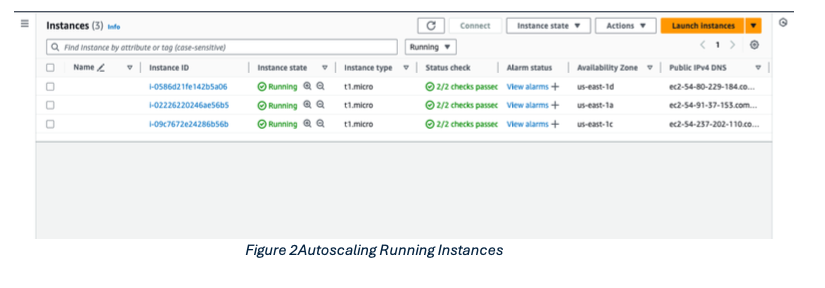
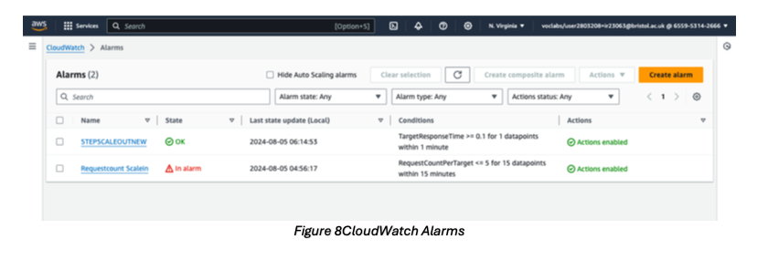
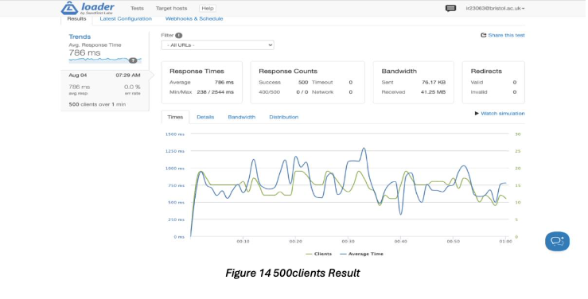
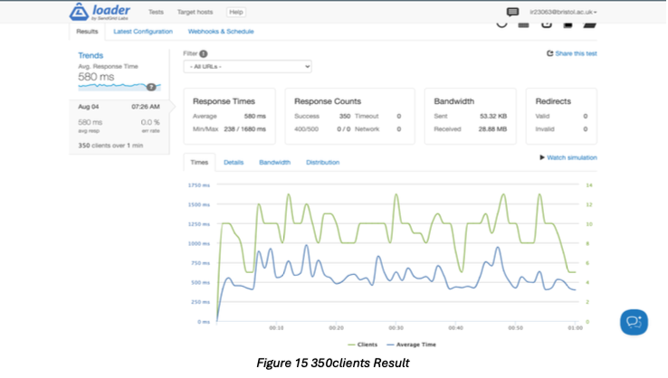
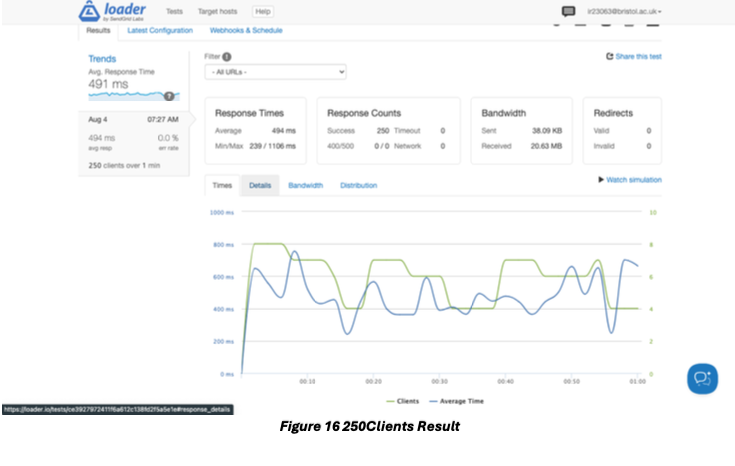

# Scalable and Secure WordPress Deployment on AWS ☁️🛡️

This project demonstrates the design, implementation, and optimization of a scalable WordPress architecture using Amazon Web Services (AWS). It includes hands-on tasks like initial deployment, Auto Scaling, Load Balancing, CloudWatch Alarms, Load Testing, Security Hardening, and Cost Optimization.

---

## 📂 Project Structure

```
├── AWS Report.docx                # Detailed architecture & analysis
├── Dashboard Images (Figures)     # Visual results from AWS Console
```

---

## 🧠 Key Objectives

- Deploy WordPress using EC2
- Configure Auto Scaling Groups and Load Balancers
- Use CloudWatch for monitoring and metric-based scaling
- Optimize cost and enhance fault tolerance
- Secure the infrastructure using IAM, WAF, and encryption
- Perform load testing and analyse response times
- Implement shared database and file system using RDS and EFS

---

## 📊 Visual Insights

### Auto Scaling Groups and Instance Management


### CloudWatch Alarms


### Load Testing Results
- **500 Clients** – Avg Response Time: 786ms ✅


- **350 Clients** – Avg Response Time: 580ms ✅


- **250 Clients** – Avg Response Time: 494ms ✅


---

## 🛠️ Technologies Used

- **AWS EC2** – WordPress hosting
- **Elastic Load Balancer (ALB)** – Load distribution
- **Auto Scaling Groups** – Instance scaling
- **Amazon RDS** – Centralized database
- **Amazon EFS** – Shared media uploads
- **Amazon CloudWatch** – Monitoring and alerts
- **IAM + WAF + KMS** – Security and compliance
- **Loader.io** – Load testing

---

## 🔐 Security & Reliability Features

- IAM roles with least-privilege access
- EC2 and S3 encryption using AWS KMS
- WAF to prevent XSS and SQLi attacks
- Shield & Security Groups to defend against DDoS
- CloudTrail and CloudWatch logs for audit

---

## 💰 Cost Optimization

- Instance right-sizing using AWS Compute Optimizer
- Use of Reserved and Spot Instances
- Lifecycle policies in S3 and EBS tuning
- Serverless (AWS Lambda) integration possibilities

---

## 📈 Performance Across Instance Types

| Clients | t1.micro | medium | large |
|---------|----------|--------|-------|
| 250     | 494ms    | 389ms  | 324ms |
| 350     | 580ms    | 457ms  | 409ms |
| 500     | 786ms    | 667ms  | 602ms |

---

## 📋 How to Reproduce

1. Deploy WordPress on a t2.micro EC2 with a Bitnami AMI.
2. Create Auto Scaling Group from Launch Template.
3. Set up CloudWatch Alarms for scaling (TargetResponseTime, RequestCountPerTarget).
4. Attach ALB and optimize listener rules.
5. Configure RDS and EFS for shared DB and media.
6. Secure architecture with IAM, WAF, and KMS.
7. Perform Load Testing with Loader.io.

---

## 📎 References

- AWS Academy Cloud Foundations
- Amazon EC2 Documentation
- AWS WAF, Shield, CloudFront, EFS, and RDS Docs
- Stack Overflow & Security StackExchange threads

---

## 👨‍💻 Author

**Uchit Bhadauriya**  
MSc Data Science, University of Bristol  
📫 [ir23063@bristol.ac.uk](mailto:ir23063@bristol.ac.uk)

---

⭐️ *Star this repo if you found it helpful. Fork it to expand or raise an issue to ask questions!*
